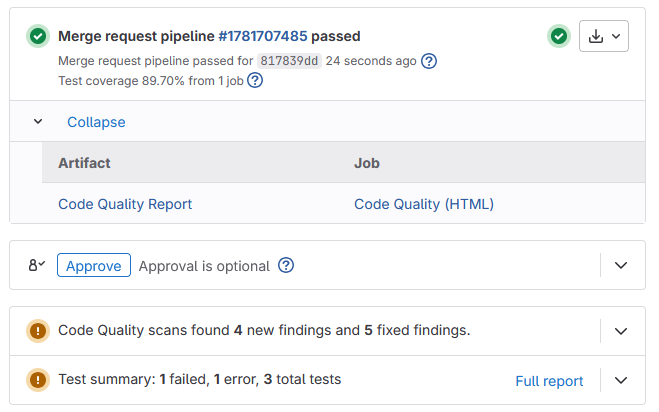

# Tanuki
Use Tanuki in your GitLab CI/CD pipelines to:
* Transform a [Unity Test Runner](https://docs.unity3d.com/2018.3/Documentation/Manual/testing-editortestsrunner.html) report to a [GitLab JUnit report](https://docs.gitlab.com/ci/testing/unit_test_reports/)
* Transform a [Unity Project Auditor](https://docs.unity3d.com/Packages/com.unity.project-auditor@1.0/manual/index.html) report to a [GitLab Code Quality report](https://docs.gitlab.com/ci/testing/code_quality/)
* Generate a static HTML Code Quality report for [GitLab Merge Requests](https://docs.gitlab.com/ci/jobs/job_artifacts/#link-to-job-artifacts-in-the-merge-request-ui)
* Print code coverage of a Unity Cobertura coverage report to [GitLab Code Coverage](https://docs.gitlab.com/ci/testing/code_coverage/)

# GitLab CI/CD
The following is a typical GitLab CI/CD configuration using Tanuki:

```yaml
Code Quality:
  image: ghcr.io/zensharp/tanuki
  rules:
    - if: $CI_COMMIT_BRANCH == $CI_DEFAULT_BRANCH
    - if: $CI_PIPELINE_SOURCE == "merge_request_event"
  script:
    - |
      # Obtain codequality.json here
      tanuki html codequality.json -o index.html --title "$CI_PROJECT_TITLE"
  artifacts:
    paths:
      - index.html
    expose_as: "Code Quality Report"
    reports:
      codequality: codequality.json

Run Unit Tests:
  image: ghcr.io/zensharp/tanuki
  rules:
    - if: $CI_COMMIT_BRANCH == $CI_DEFAULT_BRANCH
    - if: $CI_PIPELINE_SOURCE == "merge_request_event"
  script:
    - |
      # Obtain results.xml and cobertura.xml here
      tanuki transform results.xml -o junit.xml
      tanuki coverage cobertura.xml --multiplier 100
  coverage: '/Code coverage is: \d+\.\d+/'
  artifacts:
    paths:
      - junit.xml
    reports:
      junit: junit.xml
```

After every merge request pipeline, the merge request will display:
* Code coverage (i.e. Test coverage)
* Code Quality HTML report (i.e. Code Quality Report)
* Code Quality changes
* Test summary



Click "Code Quality Report" to view the HTML report.

# CLI
### Transform Between Report Formats
```shell
# Unity Project Auditor JSON to Code Climate
tanuki transform report.json --codeclimate

# Unity Test Runner XML to JUnit
tanuki transform report.xml --junit

# or let Tanuki automatically determine the format
tanuki transform report.json
tanuki transform report.xml

# By default, Tanuki prints the result to STDOUT
# Use -o|--output to write to a file
tanuki transform report.json -o codeclimate.json
tanuki transform report.xml -o junit.xml
```

### Edit a Code Climate Report
```shell
tanuki edit report.json [-o edited.json] [--location-prefix "src/Assets"] [--linter "Project Auditor"]
```

### Combine Code Climate Report
```shell
tanuki merge a.json b.json ... c.json [-o merged.json]
```

### Generate a Static HTML Report
```shell
tanuki html report.json [-o index.html] [--base-url "https://docs.example.com"] [--title "My Code Quality Report"]
```

### Print Code Coverage
```shell
tanuki coverage cobertura.xml [--multiplier 100.0]

# Output
Code coverage is: 0.897
```

# Advanced Configuration
Tanuki will search for a configuration file in the following order:
1. `./.tanuki.yml`
1. `./.tanuki/tanuki.yml`
1. `./.config/tanuki.yml`
2. `~/.config/tanuki.yml`

Add custom linters to the configuration file. When using `tanuki html`, the linters will get properly linked in the generated HTML.

```yaml
linters:
  - name: Project Auditor
    url: https://docs.unity3d.com/Packages/com.unity.project-auditor@1.0/manual/index.html
  - name: Rubocop
    url: https://docs.rubocop.org
```

# Development
[](https://gitpod.io/#https://github.com/zensharp/tanuki)

# Acknowledgements
* Tanuki's report template is based [this template](https://gitlab.com/gitlab-org/ci-cd/codequality/-/blob/master/test/expect/gl-code-quality-report.html?ref_type=heads) from [gitlab-org/ci-cd/codequality](https://gitlab.com/gitlab-org/ci-cd/codequality/-/blob/master/test/expect/gl-code-quality-report.html?ref_type=heads).
